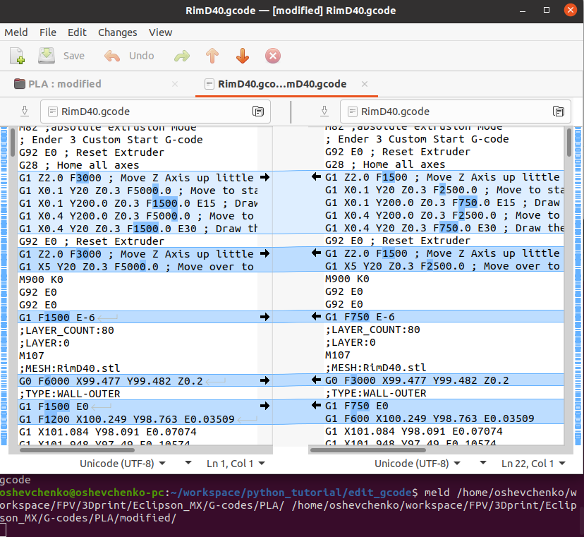

# Speed change in GCode for 3D printers (Fxxxx parameter)

Process G-code files within a specified directory, adjusting their speed by applying a multiplication factor (default: 0.5). The script creates a 'modified' sub-directory within the specified directory
and saves the updated files there.

Example:
```
$ python3 ./edit_gcode.py /home/test/G-codes/PLA/ --multiplier 0.5
The sub-directory 'modified' exists in /home/test/G-codes/PLA/
Processing file: /home/test/G-codes/PLA/Horn_x2.gcode
Processing file: /home/test/G-codes/PLA/Prop_hub.gcode
...
Processing file: /home/test/G-codes/PLA/Hinge_x16.gcode
```

